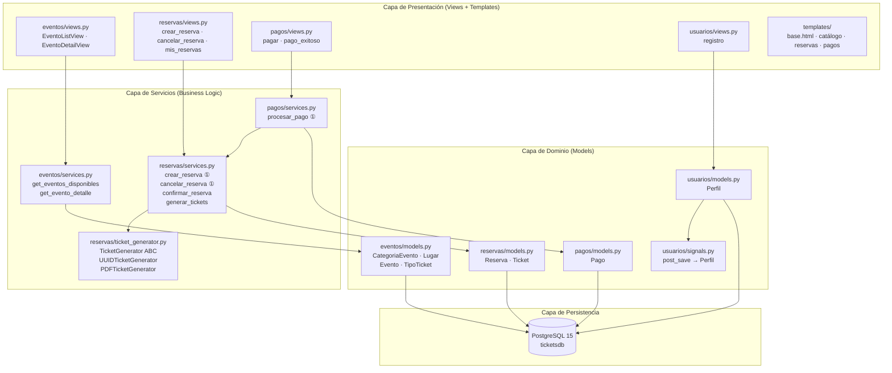
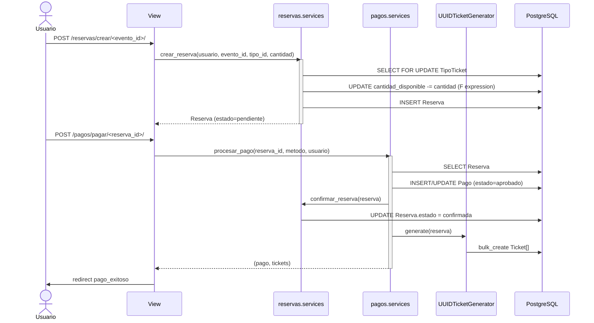
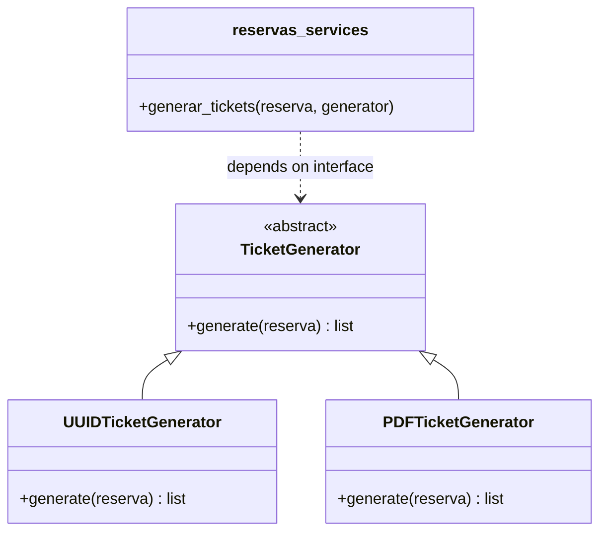
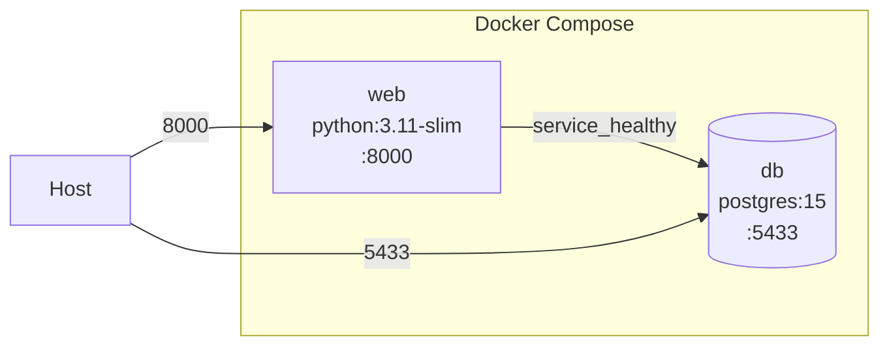

# VibePas — Diagrama de Arquitectura

## Diagrama de Capas

> ① `@transaction.atomic` + `select_for_update()` — operación atómica con bloqueo de fila

## Diagrama de Flujo — Reserva + Pago

## Principio de Inversión de Dependencias (DIP)

## Infraestructura Docker

