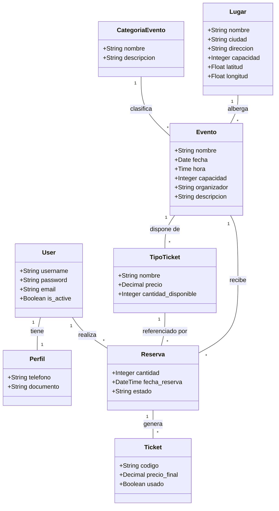

# Diagrama de Clases y Arquitectura

Adicional a la documentación técnica general, en esta página se modela de manera gráfica las relaciones implementadas entre los principales componentes del sistema, incluyendo los modelos ajustados bajo el flujo 1:N que corresponde a las reglas particulares del proyecto (Un `TipoTicket` pertenece invariablemente a un único evento).

## Modelos de Base de Datos - Diagrama ER/Clases

### Notas sobre la Arquitectura

1. **Relación Evento-TipoTicket**: Se confirmó que de cara al modelo de negocio de este proyecto particular, se gestiona una relación **1:N** (ForeingKey en TipoTicket que apunta a Evento) y no una M2M (ManyToMany), esto para garantizar que un ticket (ej. General) pertenezca e impacte la cantidad disponible de un solo evento específico y no cruce la contabilidad de entradas si existen solapamientos de ventas.
2. **Latitud y Longitud en Lugar**: En cumplimiento con los requisitos de enriquecer el modelo del Catálogo, la entidad `Lugar` posee latitud y longitud, abriendo así las puertas a la visualización de Mapas en futuras integraciones.
3. **Flujo de Reservas**: La entidad intermedia abstracta de `Reserva` es la encargada de descontar del volumen disponible de un `TipoTicket` y, al ser confirmadas o pagadas, permite desencadenar de forma explícita la creación serializada en `Ticket`.
